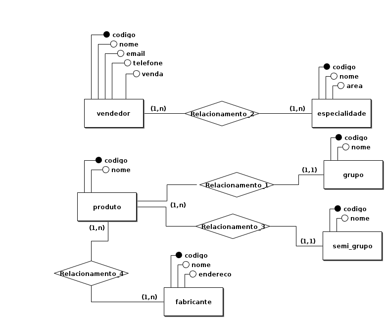
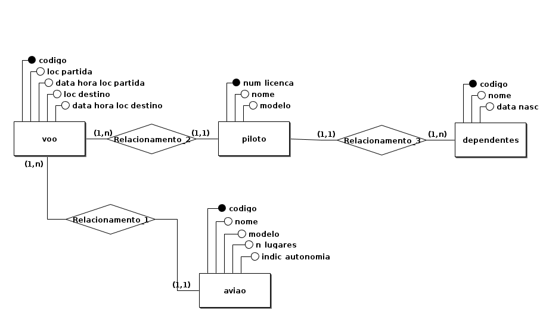
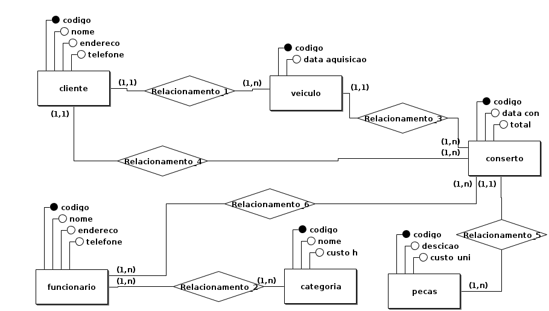

# Banco-de-dados-I
Repositório para INE5613-04238B

1) Em uma loja multidepartamento de produtos, cujos vendedores são especialistas em determinados
tipos de venda, deseja-se guardar informações em um banco de dados com o seguinte conteúdo:
- Dados dos vendedores: código, nome, e-mail, telefone e especialidades de venda - pode ser mais de uma para cada funcionário;
- O especialidades são cadastradas com código, nome e área;

- dados dos produtos: código de cadastro e nome - cada produto possui ainda, obrigatoriamente:
- o grupo, que possui código e nome;
- o subgrupo, que possui código e nome;
- o fabricante, com código, nome e endereço; um produto pode estar associado a vários
fabricantes.

2) “Uma empresa de transportes tem vários aviões. Cada avião tem, além da matrícula, um nome, o
modelo do avião, o número de lugares e a indicação da sua autonomia. Na empresa trabalham vários
pilotos. Sobre cada piloto pretende-se saber o nome e número de licença, bem como quais os modelos
de aviões que podem ser pilotados por ele. Pretende-se ainda guardar a informação relativa ao nome e
data de nascimento de cada um dos dependentes (caso existam) dos pilotos. Cada avião faz vários voos.
Cada voo deve ter, pelo menos, a indicação da data e hora em que acontecerá e os locais de partida e de
destino. Cada voo de um dado avião é pilotado por apenas por um piloto”.

3) “Uma empresa de venda de automóveis pretende implantar um sistema para gerir a informação
relativa aos consertos executados nos veículos dos seus clientes. O sistema deverá manter um registro
histórico de todos os consertos efetuados. A empresa pretende manter as seguintes informações de
seus clientes: código de identificação, nome, endereço e telefone. A empresa pretende também saber
os veículos que um dado cliente teve ou tem e as datas em que foram adquiridos. A empresa pretende
manter as seguintes informações dos funcionários de sua oficina: código de identificação, nome,
endereço, telefone e categoria. O custo horário de mão de obra depende da categoria do funcionário e
é definido através de uma tabela que é atualizada regularmente. Para cada conserto, a empresa
pretende saber qual o veículo consertado, o cliente, a data em que foi efetuado o conserto e seu custo
total. A empresa pretende também armazenar para cada conserto as peças que foram utilizadas e o seu 
preço, bem como o tempo de mão de obra gasto por cada funcionário e o respectivo custo. A empresa
pretende manter para as peças em estoque as seguintes informações: código de identificação,
descrição, custo unitário e quantidade”.

